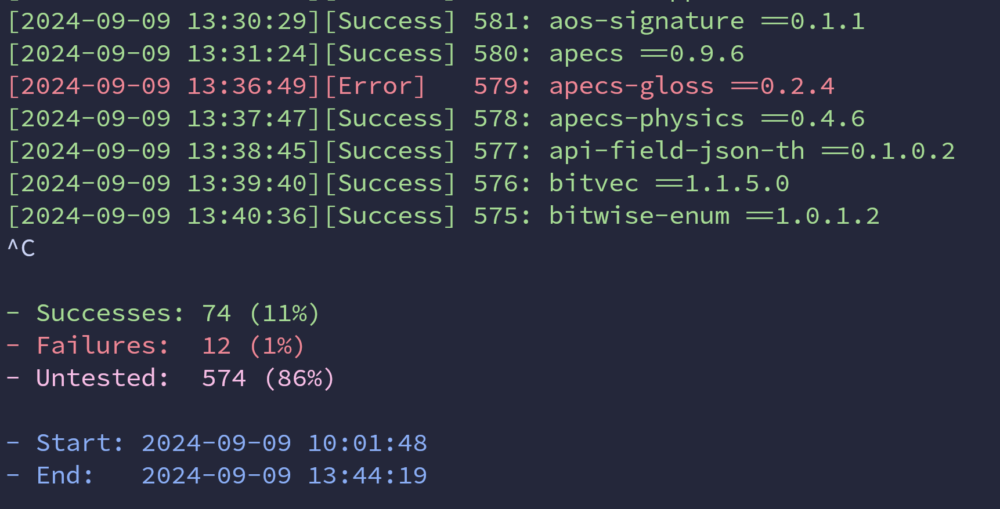

# `clc-stackage`

[](https://github.com/haskell/clc-stackage/actions/workflows/ci.yaml)

## How to?

This is a meta-package to facilitate impact assessment for [CLC proposals](https://github.com/haskell/core-libraries-committee).

An impact assessment is due when

1. Proposal makes a breaking change according to [PVP](https://pvp.haskell.org/).
2. Proposal exports a new entity from `Prelude` or other modules, described in [Haskell Report](https://www.haskell.org/onlinereport/haskell2010/haskellpa2.html#x20-192000II).
3. On discretion of CLC members.

The procedure is as follows:

1. Rebase changes, mandated by your proposal, atop of `ghc-9.10` branch.

2. Compile a patched GHC, say, `~/ghc/_build/stage1/bin/ghc`.

3. `git clone https://github.com/haskell/clc-stackage`, then `cd clc-stackage`.

4. Build the exe: `cabal install clc-stackage --installdir=./bin`.

    > :warning: **Warning:** Use a normal downloaded GHC for this step, **not** your custom built one. Why? Using the custom GHC can force a build of many dependencies you'd otherwise get for free e.g. `vector`.

5. Uncomment and modify the `with-compiler` line in [generated/cabal.project](generated/cabal.project) e.g.

    ```
    with-compiler: /home/ghc/_build/stage1/bin/ghc
    ```

6. Run `./bin/clc-stackage` and wait for a long time. See [below](#the-clc-stackage-exe) for more details.

    * On a recent Macbook Air it takes around 12 hours, YMMV.
    * You can interrupt `cabal` at any time and rerun again later.
    * Consider setting `--jobs` to retain free CPU cores for other tasks.
    * Full build requires roughly 7 Gb of free disk space.

    To get an idea of the current progress, we can run the following commands
    on the log file:

    ```sh
    # prints completed / total packages in this group
    $ grep -Eo 'Completed|^ -' output/logs/current-build/stdout.log | sort -r | uniq -c | awk '{print $1}'
    110
    182

    # combine with watch
    $ watch -n 10 "grep -Eo 'Completed|^ -' output/logs/current-build/stdout.log | sort -r | uniq -c | awk '{print \$1}'"
    ```

7. If any packages fail to compile:

    * copy them locally using `cabal unpack`,
    * patch to confirm with your proposal,
    * link them from `packages` section of `cabal.project`,
    * return to Step 6.

8. When everything finally builds, get back to CLC with a list of packages affected and patches required.

### The clc-stackage exe

Previously, this project was just a single (massive) cabal file that had to be manually updated. Usage was fairly simple: `cabal build clc-stackage --keep-going` to build the project, `--keep-going` so that as many packages as possible are built.

This has been updated so that `clc-stackage` is now an executable that will automatically generate the desired cabal file based on the results of querying stackage directly. This streamlines updates, provides a more flexible build process, and potentially has prettier output (with `--batch` arg):



In particular, the `clc-stackage` exe allows for splitting the entire package set into subset groups of size `N` with the `--batch N` option. Each group is then built sequentially. Not only can this be useful for situations where building the entire package set in one go is infeasible, but it also provides a "cache" functionality, that allows us to interrupt the program at any point (e.g. `CTRL-C`), and pick up where we left off. For example:

```
$ ./bin/clc-stackage --batch 100
```

This will split the entire downloaded package set into groups of size 100. Each time a group finishes (success or failure), stdout/err will be updated, and then the next group will start. If the group failed to build and we have `--write-logs save-failures` (the default), then the logs and error output will be in `./output/logs/<pkg>/`, where `<pkg>` is the name of the first package in the group.

See `./bin/clc-stackage --help` for more info.

#### Optimal performance

On the one hand, splitting the entire package set into `--batch` groups makes the output easier to understand and offers a nice workflow for interrupting/restarting the build. On the other hand, there is a question of what the best value of `N` is for `--batch N`, with respect to performance.

In general, the smaller `N` is, the worse the performance. There are several reasons for this:

- The smaller `N` is, the more `cabal build` processes, which adds overhead.
- More packages increase the chances for concurrency gains.

Thus for optimal performance, you want to take the largest group possible, with the upper limit being no `--batch` argument at all, as that puts all packages into the same group.

> [!TIP]
>
> Additionally, the `./output/cache.json` file can be manipulated directly. For example, if you want to try building only `foo`, ensure `foo` is the only entry in the json file's `untested` field.

## Getting dependencies via `nix`

For Linux based systems, there's a provided `flake.nix` and `shell.nix` to get a nix shell
with an approximation of the required dependencies (cabal itself, C libs) to build `clc-stackage`.

Note that it is not actively maintained, so it may require some tweaking to get working, and conversely, it may have some redundant dependencies.

## Misc

* Your custom GHC will need to be on the PATH to build the `stack` library e.g.

  ```
  export PATH=/home/ghc/_build/stage1/bin/:$PATH
  ```

  Nix users can uncomment (and modify) this line in the `flake.nix`.
